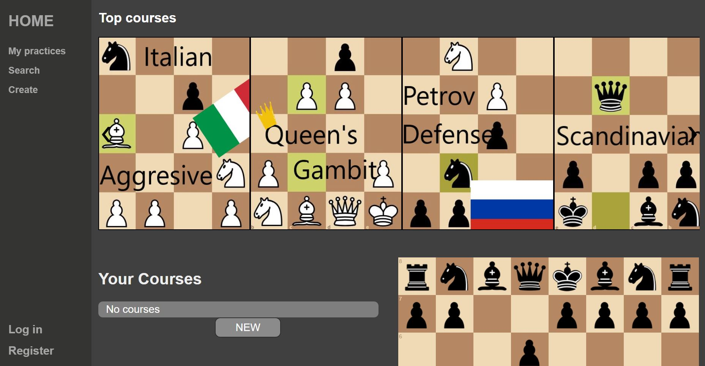
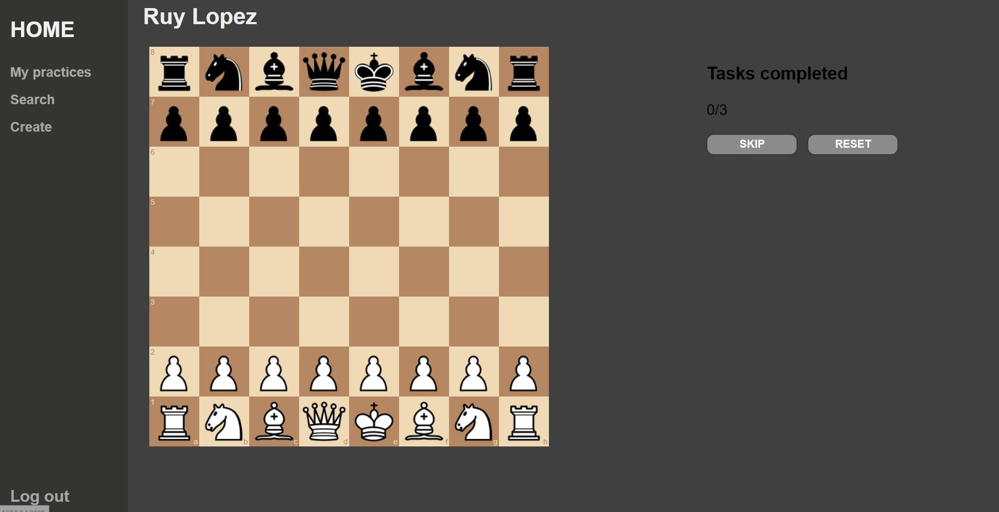
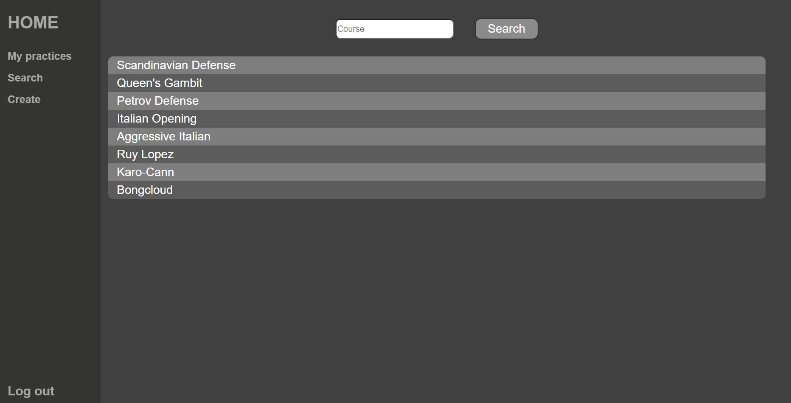

# Opening Gambit

The Opening Gambit project is a website where you can practice your chess opening repertoire. By letting the user create or use an existing course and play the same positions over and over again, they will memorize the positions and moves much faster than by other types of practice. This site won't help players to become better chess players in more aspects than the memorization of openings, topic that makes the difference in all skill levels, but especially in the beginners.

# Screenshots

## Why I choose this project
I decided to make this project because some months ago when I started to practice chess and while trying to improve I faced a problem, opening theory. None of the resources I found were what I really wanted, many of the resources try to explain the why of an opening or its variations. But none of them aim to help the user memorize the whole theory. So, when I need to choose my project idea, I inicially thought about making a restaurant recommender, but after facing some complications, I remembered my problem from some months ago, and I started this project. 

# Distintivness and Complexity

## Distintivness
The idea of this project is to help the user learn a skill, and none of the other projects in this course have its focus on that. The only comparable feature is the possibility to create something, in this case a course, and to show it to other users. But again, this is with a different objective, in Network it is to share a message, in Commerce it is to share a product and in this project, Opening Gambit, it is to share an opening practice. 

## Complexity
This project was far more complex than any other in the course, mostly because all of the implementation was up to me, including the idea, which ironically may have been the harder part. Why is that? Because trying to implement some new ideas came with a lot of problems that you did not think about before, and for example the setting of the chess board practice mechanic took me more than half the time I have spent in some of the other projects in this course. 

Speaking more generally, the complexity of this course comes with the connectivity between the front and back and with the implementation of the course and task models. What made the connectivity harder to implement was my limited ability with javascript and managing user input. Because the user is able to create and edit courses, constant communication is needed to save the data, and making all "post" requests will only make the user experience notoriously worse. The fact that each course can have any number of tasks and only the course owner should be able to edit it added another layer of complexity.

### Complexity comparison with the other projects
In the other projects the user was able to create, read, update and delete data in the company with other specific feature. This project has the same posibilities but adds more features like making a copy of another user's course and editing it to fit your own requirements. Or the game options itself, none of the other projects has an interactive feature. 

# Files
The openings folder contains the entire Django project, including the main openings folder, the chess app folder, the database and the manage.py file.

The chess folder contains the important files, including the views, models and url scripts, along with the static and templates folders.

The static folder contains a folder of the library [chessboard.js](https://chessboardjs.com), which is responsible for the chessboard being displayed and interactive. A `posters` folder containing images. And then .css and .js files, including another chess-related library [chess.js](https://github.com/jhlywa/chess.js), which handles all the chess game logic, and a well-known one [jquery.js](https://jquery.com), which is a dependency of chess.js.

The templates folder contains all the html files used in the project.

## More in deep

`autoplay.js` Has the logic of the example match displayed in the home page
`carousel.js` Has the logic of the carousel type display of the top courses
`nav-functionality.js` Has the logic of the button that displays the nav in the phone mode
`practice.js` Is a script find in the [chessboard.js](https://chessboardjs.com) website with a modification to auto make the "oponent" moves while the user is taking a course
`recorder.js` Whit the same base script as practice.js but this time recording each move and handeling all the related features of creating a course and tasks

# How to run your aplication
Becouse this project do not have more dependencis than django just by using the commands:
python manage.py makemigrations
python manage.py migrate
python manage.py runserver

And the project should be working